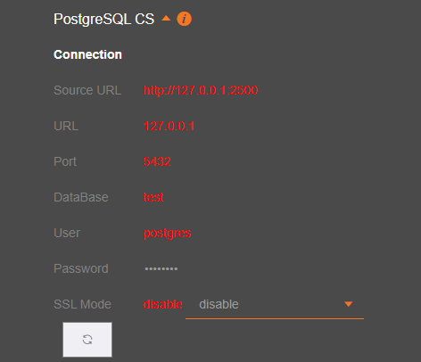
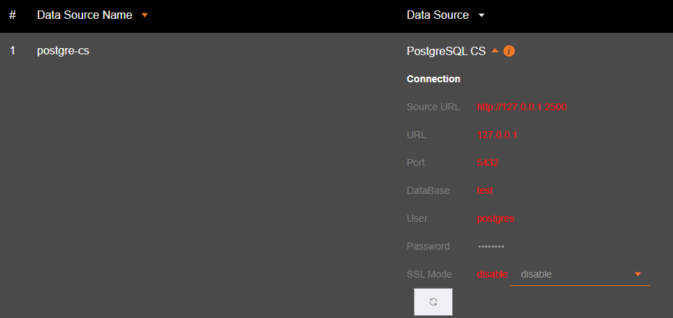
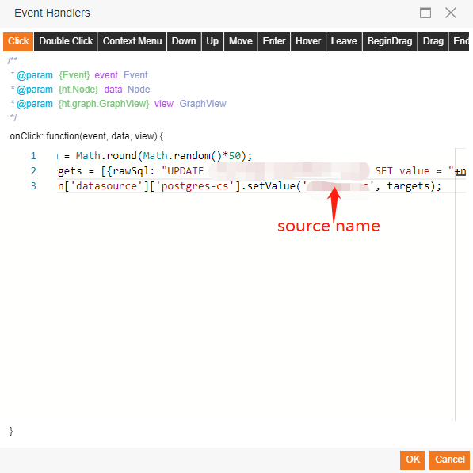

# SaaS Composer PostgreSQL plugin & Data source server  

1. Import SaaS Composer Datasource plugin with file **postgres-cs.zip**  
2. Use command `npm install` to install all node modules.  
3. Call `npm run serv` to start datasource server.  

  

- **Source URL** is the source server url.  
- **URL** is database url.  
- **Port** is database port.  
- **DataBase** the database name.  

## Update data (setvalue)

    var num = Math.round(Math.random()*50);
    var targets = [
        {
            rawSql: "UPDATE \"iot-hub-coldchain\".lujj SET value = "+num+" WHERE c1 = 'Cheese'",
            scDataType: "value",
            sourceType: "postgres",
            target: "set",
            type: "set"
        }
    ]
    scPlugin['datasource']['postgres-cs'].setValue('postgre-cs', targets);

The first parameter in setValue is the data source name, Set in config page.  

 

Use click event trigger setValue function execute.

 
